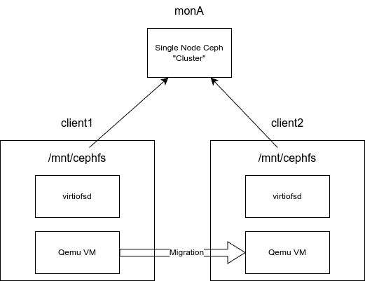

# Ceph playground

This repository contains a NixOS integration test that setups up a Ceph cluster with two clients.



The clients have been configured with scripts that launch
[virtiofsd](https://gitlab.com/virtio-fs/virtiofsd) with the ceph
filesystem as the shared filesystem together with QEMU VMs that have
access to the shared filesystem via VirtioFS. These scripts are
currently only intended to be executed when running the NixOS
integration test interactively, and are not part of the test itself.

## Installing Nix

This repository requires that you have Nix with Flakes support
enabled. You can install it via the [Determinate Nix
installer](https://zero-to-nix.com/concepts/nix-installer).

Installation via the official installer is also possible, but requires
manual configuration afterwards to enable Flakes.

## Virtiofsd

You can build a statically linked `virtiofsd` 0.11.1 binary using:

```console
$ nix -L build .#virtiofsd
```

The binary will be in `result/bin/virtiofsd`.

## Live migration PoC

Build the test to run interactively:

```console
$ nix -L build .#checks.x86_64-linux.ceph.driverInteractive
```

Run the a Python shell that we will use to interact with the test setup:

```console
$ ./result/bin/nixos-test-driver
```

Start the Ceph cluster and the two clients by running the test script:

```console
test_script()
```

Wait until you see login screens for both the client VMs (client1 and client2).

Login and open a shell in client1. 

In client1's terminal, verify that the Ceph filesystem is mounted:

```console
client1 $ mount | grep ceph
# You need to see a ceph mount here.
```

Then start the VM that we will migrate later:

```console
client1 $ start-sender-vm
```

This spawns virtiofsd with the Ceph filesystem as the shared
filesystem and launches a QEMU VM that boots from the NixOS live cd
(you may just wait until you see a prompt now). Once we obtain a
prompt we want to mount the virtiofs filesystem.

Inside the newly started VM, we will now run a preinstalled test
program that reads and prints the file contents of a file on the
virtiofs (ceph) filesystem in a loop as our VM workload.

```console
vm $ virtiofs-test
```

You should now see "Hello world" being printed repeatedly
in the terminal.

Now in client2's terminal execute the following to start the Qemu that
will be the target of the migration:

```console
client2 $ start-receiver-vm
```

which will then wait for an incoming migration.

Go back to client1's Qemu session and start the migration:

```console
(qemu) migrate tcp:192.168.1.3:2323
```

You should now shortly see "Hello world" being printed in the VM spawned by client2!

## Things to tinker

To change the virtiofsd settings, modify the `start-sender-vm` and
`start-receiver-vm` scripts in `ceph.nix`.
